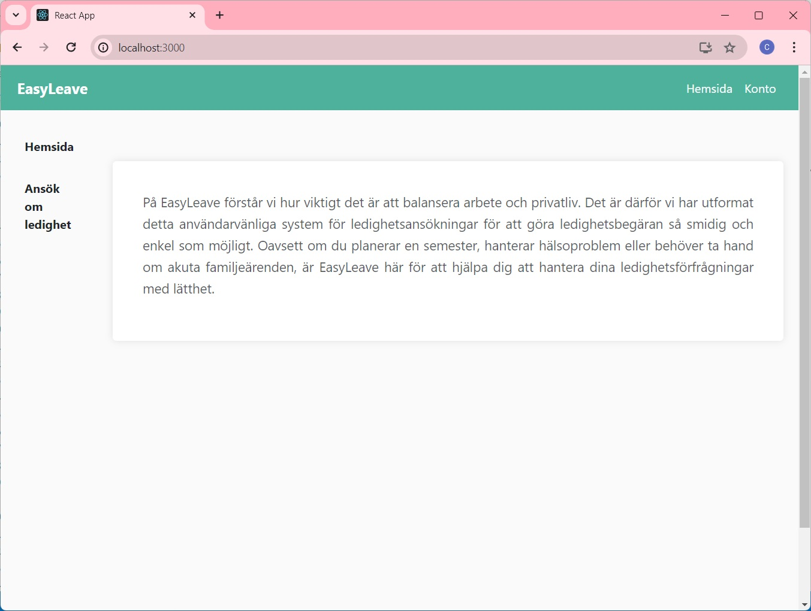
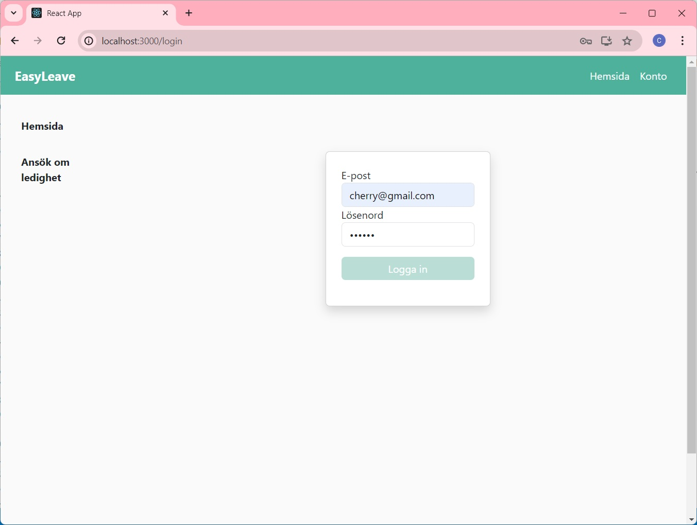
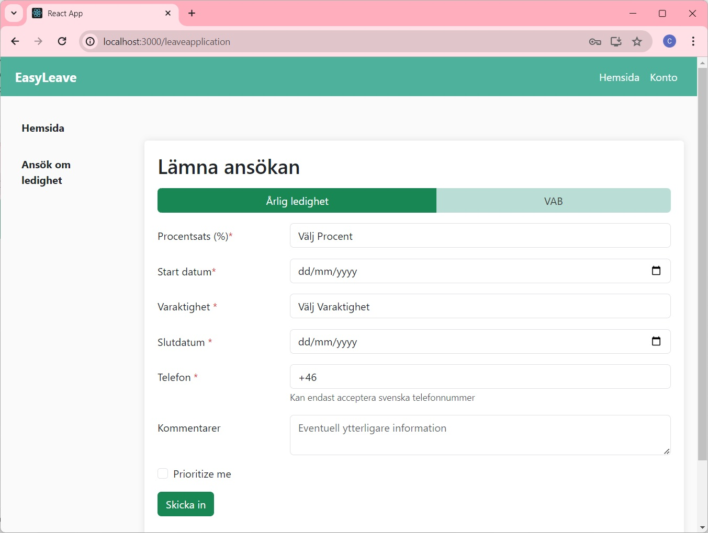
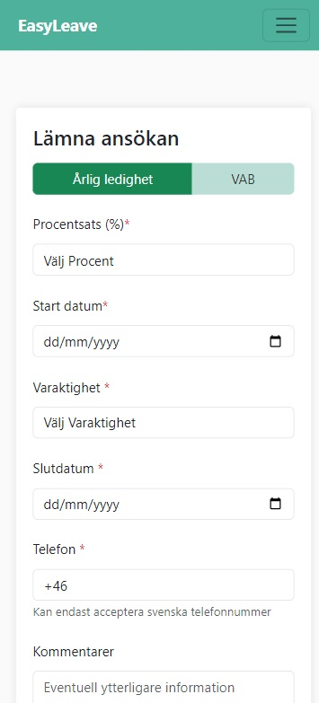

# Technical Project Description for EasyLeave App

## Executive Summary
### Description of the Application
> The EasyLeave application is a web-based leave management tool. It utilizes React for the frontend and [airtable](https://airtable.com/)  for data storage.

## Operating Environment
### Technical Architecture
> The application operates on a client-server architecture and currently functions as a frontend demo. It is built with React for structure, Bootstrap for styling, and JavaScript for programming. The design is responsive and tailored for a user-friendly experience across devices.

## Modules
### Functional Overview
> The application includes several key modules: Homepage - Offers a brief introduction to the services. Account - Allows registered users to log in. Apply for Leave - Users must log in to apply for various types of leave.

### Detailed Module Description
#### Home
> Users can see brief introduction on the Homepage.

#### Account
> Registered users can login on this page.

####  Apply for Leave
> Users must log in before applying for leave on this page.

## Mobile View Example
> This application is optimized for mobile devices, ensuring accessibility and functionality on the go.

## How to download and build locally
### Getting Started with Create React App

This project was bootstrapped with [Create React App](https://github.com/facebook/create-react-app).

Mobile View Example
This application is optimized for mobile devices, ensuring accessibility and functionality on the go.

### In the project directory, you can run:

### `npm start`

Runs the app in the development mode.\
Open [http://localhost:3000](http://localhost:3000) to view it in your browser.

### Learn More

You can learn more in the [Create React App documentation](https://facebook.github.io/create-react-app/docs/getting-started).

To learn React, check out the [React documentation](https://reactjs.org/).

###  Modify environments information
> If you want to change the APIKey, modify it in C:\Cherry\Fullstack\Leave system\leave-application\src\constants\tokens.js

## Version Information
> Draft version 7th May,2024  
> Modify the Navigation bar styling 10th May,2024  
> Final version 17th May,2024

