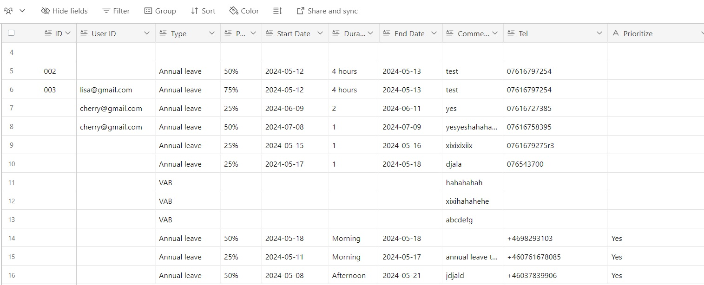

# Test Case for EasyLeave App

## Test Objective
Verify the functionality of the LeaveApplication component, ensuring that form field validation, data submission, and error handling work correctly.

## Test Environment
Browser: Chrome, Firefox
Operating System: Windows 10
Mobile Devices: iOS (Safari), Android (Chrome)
Test Data: Test user ID 002

## Pre-conditions
The user is logged in and has navigated to the LeaveApplication component page.

## Test Cases
### Test Case 001: Form Field Validation Test Steps: 
> 1. Navigate to the LeaveApplication page. 
> 2. Attempt to submit the form without filling in any fields.  
> Expected Result: 
> An error message "Alla fält markerade med * är obligatoriska." (All fields marked with * are required) is displayed.

### Test Case 002: Correctly Fill Out and Submit the Form 
> 1. Navigate to the LeaveApplication page. 
> 2. Select "Årlig ledighet" as the leave type. 
> In the "Procentsats (%)" field, select 50%. 
> In the "Start datum" field, enter 2023-01-01. 
> In the "Varaktighet" field, select Morning. 
> In the "Slutdatum" field, enter 2023-01-02. 
> In the "Telefon" field, enter +46123456789. 
Click the "Skicka in" button to submit the form.  
> Expected Result: 
> A prompt "Lämna ansökan som har skickats in." (Leave application has been submitted) appears indicating successful form submission.
The console displays the submitted json data, the data can be found on DB 
> Users can see brief introduction on the Homepage.

### Test Case 3: Validate Phone Number Field/Switch Leave Types/Date and Duration Validation/User Feedback and Error Handling/Accessibility Compliance...

